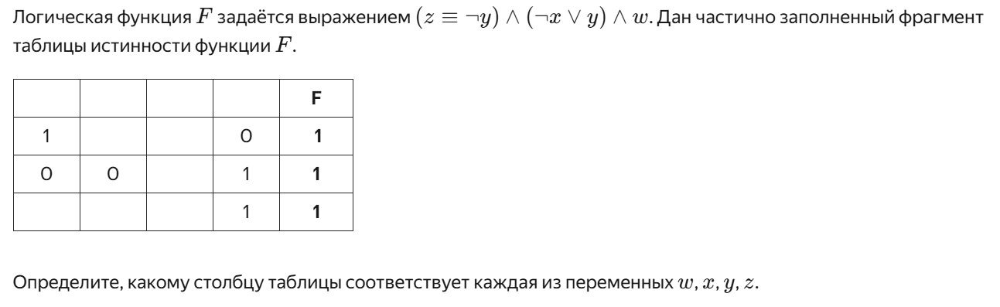
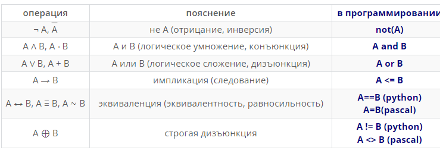

# Задание 2: начало, руками

Дата: 09.09.25
Доска: https://board.vk.com/?uid=ce19f517-f3e1-4ba0-9390-98a63ef879fc

## Пример задания

## Конспект
В задании дана булева функция - это такая функция, которая принимает аргументы, которые могут принимать два значения (0 и 1). Значением этой функции также может быть только 0 или 1. В задании перепутаны строки и строки и нужно сопоставить каждой строке её переменную. 
Пусть $n$ - количество переменных, которые идут на вход функции, тогда количество наборов переменных выражается по формуле $N = 2^n$. 

### Булевые функции 

## Домашняя работа
[Клик](Homework.md)