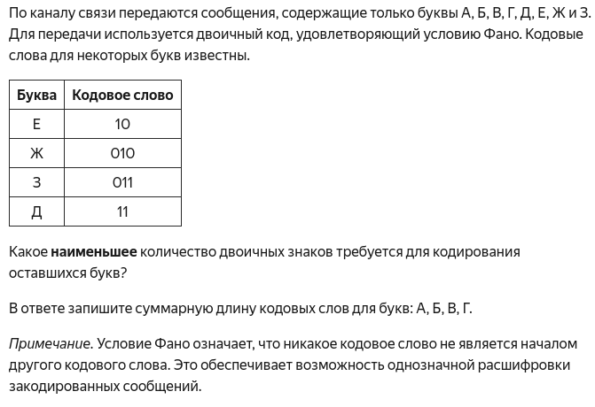

# Задание 4

- Дата: 12.09.25
- Доска: [Клик](https://board.vk.com/?uid=381148f4-14e1-4998-8a1b-99509d47174a)

## Пример задания

                                                                                                                                 

## Конспект
- Кодирование и декодирование данных. Условие Фано.
- Алфавит — набор символов. Код — правило замены символа на последовательность 0/1.
- Условие Фано: Ни одно кодовое слово не может быть началом (префиксом) другого.
- Условие Фано гарантирует однозначное декодирование. Без него при передаче сообщения невозможно точно понять, где заканчивается одно кодовое слово и начинается другое.

Пример:

```
А → 0, Б → 10, В → 11
Сообщение АБВА → 010110
```

## Домашняя работа
- [Клик](Homework.md)